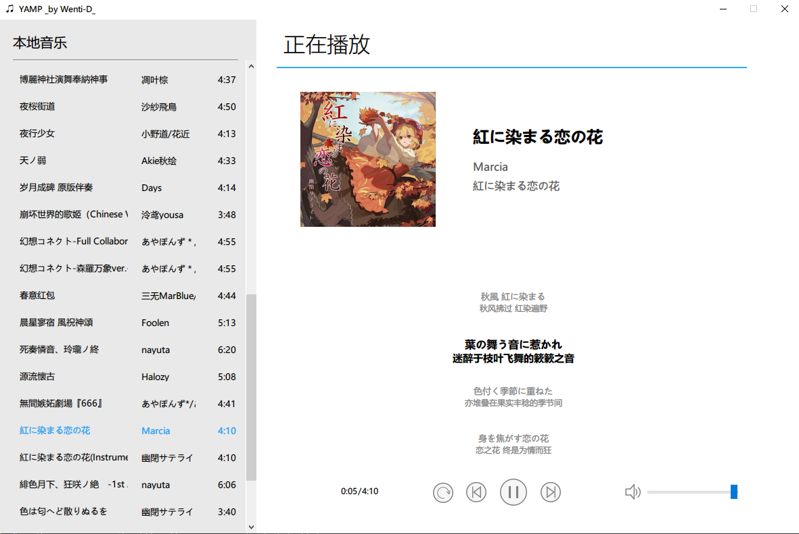
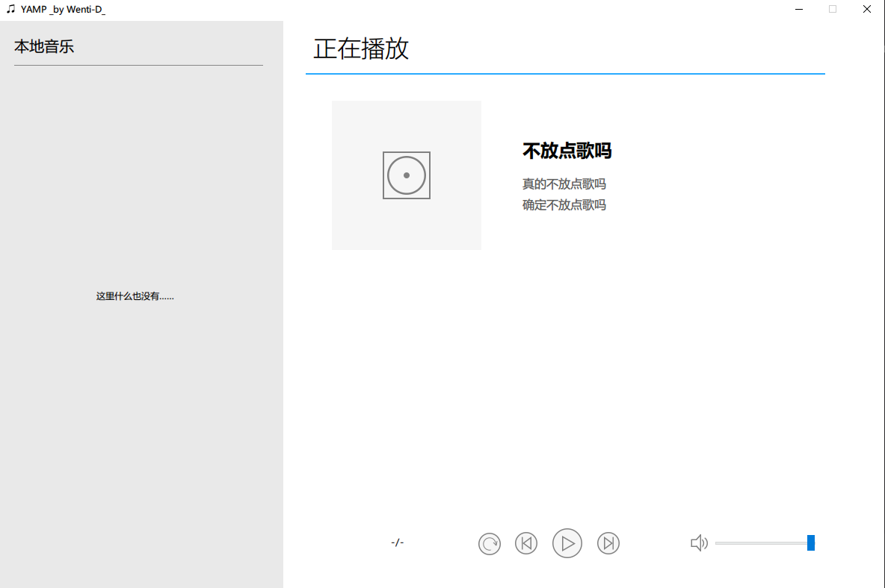

# YAMP - 只是另一个播放器

## 介绍

本项目是湖南大学 2020 级机械类专业《计算与人工智能概论》课程的“团队作业”项目选题“播放器的设计与实现”的源代码。~~氦，什么团队作业，几乎全是爷写的~~ 是一个依赖 `wxpython` 包的 GUI 播放器。

这个播放器运行起来之后大概会是这个样子：



如你所见，它支持专辑封面、歌曲信息、歌词显示，同时支持读取 mp3 与 flac 文件内嵌歌词。可惜不能拖动进度条 ~~（因为太麻烦了）~~ 。

## 运行

本项目基于 Python 3，依赖 `wxpython` 进行 GUI 设计，依赖 `pygame` 包支持音乐播放，依赖 `mutagen` 包进行歌曲内嵌信息读取，依赖 `PIL` 包进行图像处理。在运行前，请确保安装有 Python 3 并安装以上 Python 包：

- 安装 `wxpython`：
    ```
    pip install -u wxpython
    ```
- 安装 `pygame`：
    ```
    pip install -u pygame
    ```
- 安装 `mutagen`：
    ```
    pip install -u mutagen
    ```
- 安装 `PIL`：
    ```
    pip install -u pillow
    ```

安装完成后，在本项目根目录下打开终端窗口，执行
```
python player.py
```
即可运行。

## 使用

初次运行时，程序会在其本身目录下创建 “Music”、“Album”、“Lyrics”三个文件夹，而打开的窗口会是这样：



只需将音乐文件移入“Music”文件夹，重新运行程序，即可识别该文件夹下的音乐文件并自动处理，并将提取出来的专辑封面写入 `./Album/专辑名称.png` 文件，将提取出来的内嵌歌词写入 `./Lyrics/歌曲文件名.lrc` 文件。

由于本项目根据音乐文件内嵌的标签来识别歌曲信息，若想修改信息，只能通过歌曲标签编辑软件（如 [音乐标签](https://www.cnblogs.com/vinlxc/p/11347744.html)）或使用 Python 的 `mutagen` 包进行修改。

### 关于歌词显示

本项目并非直接从歌曲信息中直接读取歌词并显示，而是读取前述写入的对应 lrc 文件进行处理。故可以通过向 Lyrics 文件夹中添加 lrc 文件来为歌曲添加歌词。但本项目歌词显示**仅支持标准 LRC 格式**。即：
- 每行歌词前的时间标签格式为 `[xx:xx.xx]` （`xx` 为两位数字）；
- 支持整体偏移量 `[offset:xxx]` 标签（`xxx` 为以毫秒为单位的任意整数，正值延后，负值提前）；
- 不支持行内字词之间的时间标签。

另外，本项目支持在歌词中为外文歌词添加翻译并显示，但请注意：**每行歌词中外文与翻译之间使用 ` // ` 进行分割**，即“双斜杠左右各一空格”。

## 其他说明

本项目因一开始使用了绝对坐标进行 GUI 设计，故无最大化与调整大小功能。

本项目暂时只支持 mp3 文件与 flac 文件。

不推荐在非 Windows 平台运行本项目。

本项目暂时仅在 Python 3.9.0 64-bit on Windows 10 20H2 环境下进行过测试，如有 BUG 请报 issue。

有一说一 `wxpython` 的局限性还是太大了，很难做到完全自定义控件样式。这好吗？这不好。